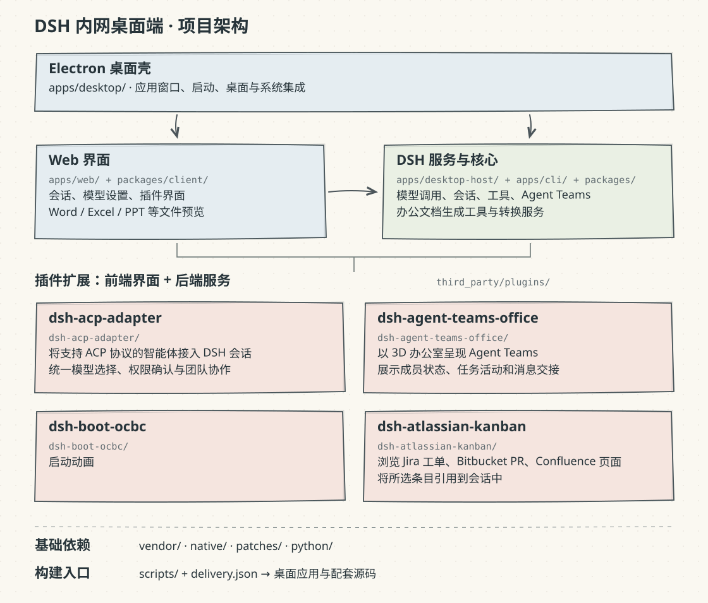

# DSH 内网桌面端

## 项目架构

## 相对 DSH 0.2.0-rc.2 的改动

1. 默认直接进入内网工作区，关闭官方账户欢迎、登录、账户设置和联系我们入口。
2. 关闭 DeepSeek 官方模型适配器及 API Key 配置引导，默认模型留空，未配置时显示“请选择模型”。
3. 桌面数据默认保存到独立的 `~/.dsh-desktop`，隔离配置和会话。
4. 新增内网 Mac ARM64、Windows x64 ZIP 交付路径，包含运行依赖，关闭该交付路径的自动更新。
5. 补充原生 Office 文件的解包规则，确保转换所需的原生目录和文件可被直接访问。
6. GUI 启动时补齐终端 PATH，为插件安装统一传递代理、证书和 npm 环境设置。
7. 桌面应用图标统一为黑色鲸鱼。
8. 内联代码 URL 检测先用 `URL.canParse` 判断，减少流式渲染时捕获解析异常的开销。
9. CSS 构建标识改用仓库相对路径，避免构建机绝对路径进入产物。
10. 支持无 Git 元数据的源码包重建，保留功能所需生成步骤，移除普通文档与历史说明。
11. 使用 `delivery.json` 统一版本，输出桌面包、同版本源码包及校验清单，过滤个人配置、依赖缓存和旧产物。
12. 当前便携桌面基线集成 dsh-acp-adapter、dsh-agent-teams-office、dsh-boot-ocbc 和 dsh-atlassian-kanban，统一从仓库内源码构建。
13. 内网禁用新版桌面产品事件采集与导出，并继续保留 `DSH_TELEMETRY_MODE=DISABLED`；非内网配置保持上游装配行为。

默认源码归档保留完整工作区和插件源码、冻结依赖锁、运行提示/技能、许可证以及实际构建和便携包验证脚本；仅便携包验证直接使用的少量 fixture 会保留，其他测试、普通文档、CI 和维护/发布工具不进入归档。提取后在支持的 Node.js 22.19+ 环境运行 `pnpm install --frozen-lockfile` 和 `pnpm build`。需要开发测试源码时可显式执行 `pnpm package:source --with-tests`。
